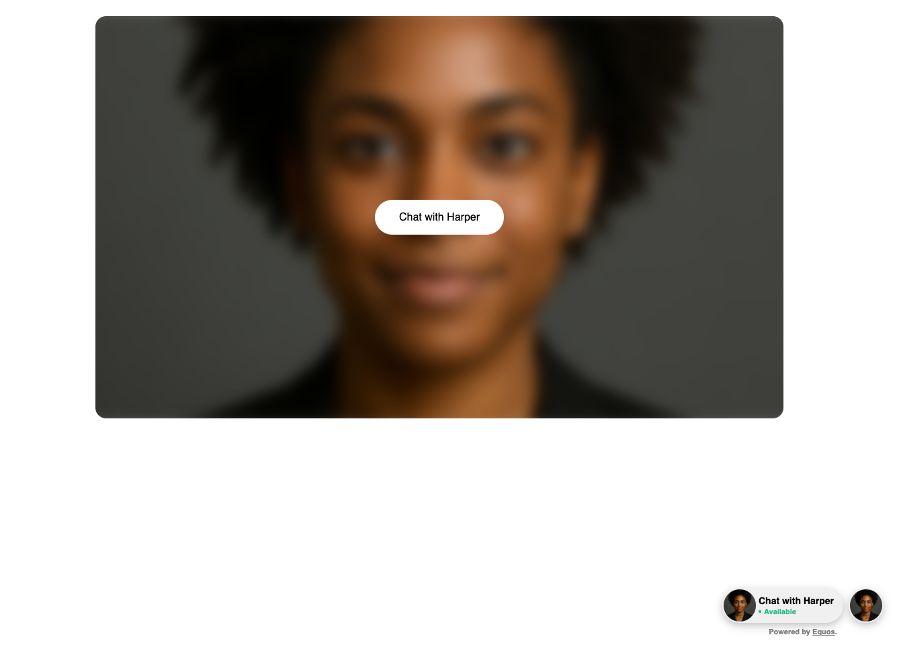

# @equos/browser-sdk
[Equos.ai](https://www.equos.ai) official BrowserJS SDK & React Components.



## Prerequisites
- Go to [Equos Studio](https://studio.equos.ai).
- Create an organization.
- Create a client Key.


## Installation
```bash
npm install @equos/browser-sdk
```

## React Components Usage
[Check our react sample app.](https://github.com/EquosAI/equos-examples/blob/main/examples/equos-react-integration/README.md)

```ts
import { useEffect, useRef } from 'react';
import { initEquosBrowser } from './src/core/equos';
import { EquosLocale } from './src/core/utils/copy.utils';
import {
  EquosBubbleList,
  EquosPlaceholderTrigger,
  EquosPopup,
} from './src/react';
import { EquosBrowserEvent } from './src/core/types/equos.types';

const equos = initEquosBrowser('');

equos.setPreferredLanguage(EquosLocale.EN);

function App() {
  useEffect(() => {
    equos.on(EquosBrowserEvent.started, (event: Event) => {
      console.log(event);
      console.log((event as CustomEvent).detail);
    });

    equos.on(EquosBrowserEvent.ended, (event: Event) => {
      console.log(event);
      console.log((event as CustomEvent).detail);
    });


    // You can also start and stop sessions programmatically
    // equos.start(config)
    // equos.stop(config)
  }, []);

  const agent = useRef({
    agentId: '',
    avatarId: '',
    name: 'Agent',
    thumbnailUrl: '',
  });
  const agents = useRef([agent.current, agent.current]);

  const dark = false;
  const modal = true;
  const ghost = false;
  const size = 512;

  const direction = 'row';

  const overrideWidth = 1024;
  const overrideHeight = 600;

  const alignX = 'right';
  const alignY = 'bottom';

  return (
    <>
      <div
        style={{
          backgroundColor: 'white',
          height: '100vh',
          width: '100vw',
          display: 'flex',
          justifyContent: 'center',
          alignItems: 'center',
        }}
      >
        <div
          style={{
            backgroundColor: 'white',
            height: `${overrideHeight || size}px`,
            width: `${overrideWidth || size}px`,
          }}
        >
          <EquosPlaceholderTrigger
            agent={agent.current}
            dark={dark}
            modal={modal}
            ghost={ghost}
          />
        </div>
      </div>

      <EquosPopup alignX={alignX} alignY={alignY}>
        <EquosBubbleList
          agents={agents.current}
          alignX={alignX}
          windowSizeInPixels={size}
          direction={direction}
          dark={dark}
        />
      </EquosPopup>
    </>
  );
}

export default App;
```

You don't have a client key ? [Create one here](https://studio.equos.ai)


## Reach Us
- Equos Slack Community: [Join Equos Community Slack](https://join.slack.com/t/equosaicommunity/shared_invite/zt-3d8oy19au-jZpsJB0i~gdL0jbDswdzzQ)
- Support: [Support Form](https://docs.google.com/forms/d/e/1FAIpQLSdoK7LvORdQf7KOQKvhhlESStJcKc3bDB9HPsEet6LuOmVUfQ/viewform)

## Documentation

- Official Documentation: [https://docs.equos.ai](https://docs.equos.ai)
- Equos NodeJS Usage Examples: [https://github.com/EquosAI/equos-examples/tree/main/examples/equos-nextjs-integration](https://github.com/EquosAI/equos-examples/tree/main/examples/equos-nextjs-integration)
- Equos Python Examples: [https://github.com/EquosAI/equos-examples/tree/main/examples/equos-python-integration](https://github.com/EquosAI/equos-examples/tree/main/examples/equos-python-integration)
- Equos React Examples: [https://github.com/EquosAI/equos-examples/blob/main/examples/equos-react-integration/README.md](https://github.com/EquosAI/equos-examples/blob/main/examples/equos-react-integration/README.md)


## Authors
- [Loïc Combis](https://www.linkedin.com/in/lo%C3%AFc-combis-a211a813a/)
